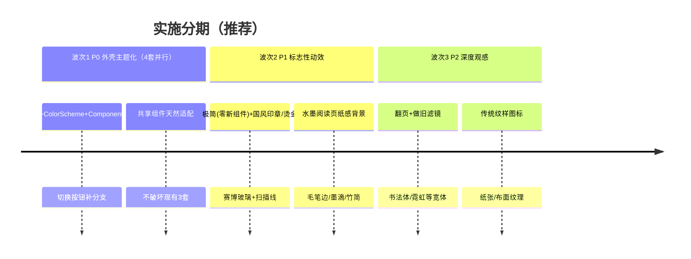

# 创作阅读助手 · 新增 4 套视觉主题 PRD（简单模式）

> 角色：产品经理 许清楚（Xu） ｜ 技术栈：Android（Kotlin + Jetpack Compose + Material3 + Hilt）
> 配套既有系统：`VisualStyle` 枚举 + `resolveThemeParams()` + `componentSpecForStyle()` + `VisualStyleProvider`（广播 `LocalVisualStyle / LocalComponentSpec / LocalGlassPalette`）+ 7 个共享组件（全消费 `LocalComponentSpec`）。
> 本 PRD 为**设计规格**，不含任何 Kotlin 代码。

---

## 0. 项目信息

| 项 | 值 |
|---|---|
| Language | 中文（与需求一致） |
| 编程栈 | 既定 Android（Kotlin + Jetpack Compose + Material3 + Hilt），**不改动** |
| Project Name | `add_four_visual_themes` |
| 原始需求 | 在现有「墨韵·素笺 / Apple / 清新」3 套基础上，**新增 4 套**：① 水墨韵 ② 赛博朋克霓虹 ③ 极简纸感 ④ 国风古籍（设计意图逐字照录于任务书，此处不重写） |
| 产出模式 | 简单 PRD（默认模式），聚焦问题分析与需求拆解 |

---

## 1. 产品目标

本次在**不破坏现有 3 套主题**的前提下新增 4 套视觉主题，核心原则是**完全复用既有主题机制、以 Token 驱动**：每一套新主题 = 1 个 `VisualStyle` 枚举项 + 1 套 `ColorScheme`/`Typography`/`Shapes`（经 `resolveThemeParams` 注入）+ 1 个 `ComponentSpec` 实例（经 `componentSpecForStyle` 注入）。凡能由「颜色令牌 + 组件令牌」表达的观感（配色、圆角、描边、阴影、留白、分割线粗细、字体字阶），一律走既有机制，让 7 个共享组件（`SectionCard / GlassCard / SelectablePill / SettingRow / SectionDivider / EmptyStateHint / SheetHandle`）天然适配，零改共享组件本体。仅当观感超出 Token 能力（毛笔边框、墨滴扩散、霓虹玻璃、扫描线、印章按钮、翻页、做旧滤镜、传统纹样图标）时，才新增**独立自定义组件**，且自定义组件自身仍须消费 `LocalComponentSpec` 取圆角/描边，遵守「圆角一律走 Token、禁止硬编码魔法数字」铁律。

---

## 2. 用户故事

| 主题 | 用户故事 |
|---|---|
| ① 水墨韵 | 作为**诗词/古籍爱好者**，我希望 App 呈现宣纸与淡墨晕染的文人气质，翻阅时像在读一本古籍，从而获得沉浸、安静的阅读心境。 |
| ① 水墨韵 | 作为用户，我希望点按按钮时有墨滴扩散的反馈，让交互也有「笔墨」感而非生硬。 |
| ② 赛博朋克霓虹 | 作为**科技/二次元爱好者**，我希望 App 像一块霓虹数据面板，深黑底 + 发光描边 + 等宽字体，满足赛博审美与酷感。 |
| ② 赛博朋克霓虹 | 作为用户，我希望悬停/点击卡片有扫描线与外发光，获得「通电」的反馈。 |
| ③ 极简纸感 | 作为**长时间阅读与专注写作的用户**，我希望界面纯白、无阴影无渐变、大量留白、层级靠字重而非颜色，减少视觉噪音、降低疲劳。 |
| ④ 国风古籍 | 作为**偏爱传统美学**的用户，我希望 App 像一册线装书（深青布面 + 烫金边 + 朱红印章按钮），阅读时有翻页与做旧质感。 |

---

## 3. 需求池（按 P0 / P1 / P2，逐主题）

> 标注「🔧 依赖新增自定义组件」的项，需新建独立 Composable / Drawable / Indication，不得塞进共享组件。
> 标注「⚠️ 触及阅读核心」的项，需谨慎评估 ReaderScreen 的 ANR/OOM 纪律。

### ① 水墨韵（Ink Wash）
| 优先级 | 需求 | 依赖 |
|---|---|---|
| **P0** | 枚举项 `INK_WASH` + 明/暗双 `ColorScheme`（宣纸暖白底、墨黑主色、赭石红点缀）+ 宋体标题字阶 + `InkWashComponentSpec`（扁平、1dp 留白灰发丝边、无投影） | 既有机制 |
| **P0** | `ThemeSwitchButton.displayName()/accentPreview()` 补 `INK_WASH` 分支（否则编译不过）；走普通 `Scaffold` 底栏（与 DEFAULT/WEB 一致） | 既有机制 |
| **P1** | 标题书法感：标题字族用 `FontFamily.Serif`（宋体，零成本落笔墨气质） | 系统字体 |
| **P1** | 🔧 毛笔笔触边框（不规则手绘边角）——新增 `BrushBorder` 装饰层包裹 `SectionCard` | 新组件 |
| **P1** | 🔧 墨滴扩散点击反馈——新增 `InkDropIndication`（自定义 `Indication`）替换默认 ripple | 新组件 |
| **P1** | ⚠️ 阅读页纸感背景：阅读器底色改米黄宣纸 `#F0E6D2`、正文深棕 `#3B2F25`（仅覆盖 ReaderScreen 背景与文字色，不动解析/懒加载逻辑） | 局部覆盖 |
| **P1** | 🔧 竹简纹路分割线——`SectionDivider` 的替代观感（竹节纹理），可新增 `BambooDivider` | 新组件 |
| **P2** | 🔧 宣纸纹理层（淡墨晕染渗透）——参考 mobile 端 `paper-grain.css`，以可平铺噪点资源 / 运行时 `ShaderBrush` 实现背景纹理 | 新资源/组件 |
| **P2** | 可选内置书法体（Ma Shan Zheng）仅用于 display 级标题（见 §5 字体决策） | 字体资源 |

### ② 赛博朋克霓虹（Cyberpunk Neon）
| 优先级 | 需求 | 依赖 |
|---|---|---|
| **P0** | 枚举项 `CYBERPUNK` + **暗色专属** `ColorScheme`（深黑底、霓虹青主色、品红/紫辅助）+ 等宽字阶 + `CyberpunkComponentSpec` | 既有机制 |
| **P0** | `ThemeSwitchButton` 补分支；走普通底栏 | 既有机制 |
| **P0** | 🔧 玻璃态深色底板 + 外发光：`glassEnabled=true` + 提供 `CyberpunkGlassPalette`（经 `LocalGlassPalette` 广播），复用既有 `GlassSurface` 的 rim/sheen/specular 叠加层 | 复用 GlassSurface |
| **P1** | 🔧 霓虹渐变描边（品红+青+紫）——`CyberpunkGlassPalette` / `BrushBorder` 变体，发光描边替代 `borderWidth`（本主题 `borderWidth=0`） | 新组件/调色板 |
| **P1** | 🔧 扫描线动效——新增 `ScanLineOverlay`（悬停/点击时扫过），叠加于卡片 | 新组件 |
| **P1** | 数据面板式布局：靠既有 `ComponentSpec`（间距、卡片底色）体现，无需新组件 | 既有机制 |
| **P1** | 等宽/科技感字体：标题/数据用 `FontFamily.Monospace`（系统），零成本 | 系统字体 |
| **P2** | 可选内置等宽体（Share Tech Mono，仅拉丁，约 100KB）用于真·科技感（见 §5） | 字体资源 |
| **P2** | 🔧 导航栏线框发光图标——新增 `ic_*_neon` 矢量资源（P0 阶段先用现有图标按霓虹色 tint） | 新资源 |

### ③ 极简纸感（Minimal Paper）
| 优先级 | 需求 | 依赖 |
|---|---|---|
| **P0** | 枚举项 `MINIMAL` + 明/暗双 `ColorScheme`（纯白/浅米底、近黑主色、1px 浅灰描边）+ 字阶**靠字重/字号分层、不靠颜色** + `MinimalComponentSpec` | 既有机制 |
| **P0** | `ThemeSwitchButton` 补分支；走普通底栏 | 既有机制 |
| **P0** | **零自定义组件**：无边框纯色块按钮、6–8dp 小圆角、无阴影无渐变、大留白，全部由 `ComponentSpec` 表达（`cardElevation=0`、`glassEnabled=false`、`sectionGap` 拉大） | 既有机制 |
| **P1** | 极简线性图标：现有 `ic_*_line` 资源（Apple 已在用）可复用并改为中性灰 tint，无需新建 | 复用资源 |
| **P2** | 极克制的入场淡入（非必要，避免破坏「呼吸感」） | 新动效（可选） |

> 说明：极简纸感是 4 套里**唯一纯 Token 驱动、零新组件**的主题，应作为「机制验证样板」优先落地。

### ④ 国风古籍（Classic CN）
| 优先级 | 需求 | 依赖 |
|---|---|---|
| **P0** | 枚举项 `CLASSIC` + 明/暗双 `ColorScheme`（深青布面底、古籍纸面卡片、烫金主色、朱红辅助）+ 宋体标题字阶 + `ClassicCnComponentSpec`（烫金 1dp 描边、无投影） | 既有机制 |
| **P0** | `ThemeSwitchButton` 补分支；走普通底栏 | 既有机制 |
| **P1** | 🔧 印章/篆刻按钮（方形圆角 + 朱红描边 + 按压「钤印」反馈）——新增 `SealButton` | 新组件 |
| **P1** | 烫金边框：由 `ComponentSpec.borderWidth/outline`（烫金色）直接驱动，共享组件天然获得 | 既有机制 |
| **P1** | 🔧 古籍页边竖线分割——新增 `ClassicVerticalDivider`（列表项间竖线，替换横向 `SectionDivider`） | 新组件 |
| **P2** | ⚠️ 阅读页翻页效果 + 做旧滤镜——新增 `PageFlipTransition` 与 `AgedPaperOverlay`，**仅作用于 ReaderScreen 阅读容器**，不碰解析/懒加载（严守 ANR/OOM 纪律） | 新组件 / 触及阅读核心 |
| **P2** | 🔧 传统纹样线稿图标（云纹/回纹）——新增 `ic_*_classic` 矢量资源（P0 先用现有图标按烫金 tint） | 新资源 |
| **P2** | 🔧 深青布面纹理 + 烫金纹理——参考 ① 的纹理方案，可平铺资源或 `ShaderBrush` | 新资源/组件 |

---

## 4. UI 设计稿（重点）

### 4.1 主题① 水墨韵（INK_WASH）
**主色板（Material3 关键 token）**
| Token | Hex | 说明 |
|---|---|---|
| background | `#F2ECDD` | 宣纸暖白（页面底） |
| surface | `#FBF7EE` | 卡片宣纸亮面 |
| primary | `#2E2A26` | 墨黑（主交互色） |
| onPrimary | `#F2ECDD` | 墨黑上的纸色字 |
| secondary | `#A8432A` | 赭石红（点缀/印章） |
| onSurface | `#2B2620` | 深棕黑（正文） |
| onSurfaceVariant | `#6E655A` | 淡墨灰（次级文字） |
| outline | `#D9CFBE` | 留白灰（发丝描边） |
| outlineVariant | `#E7DFD0` | 更淡描边 |
| error | `#9E3B2E` | 赭红（错误） |
| scrim | `#2B2620`@32% | 遮罩 |

**字体策略**：标题 `FontFamily.Serif`（宋体，落笔墨感）；正文/UI `FontFamily.Default`（黑体）。**默认不内置字体文件**（遵循包体积铁律）；书法体（Ma Shan Zheng）仅作 P2 可选 display 级增强。
**组件规格**：`cardRadius=16dp`、`listItemRadius=12dp`、`borderWidth=1dp`(subtle)、`cardElevation=0`、`glassEnabled=false`、`dividerThickness=1dp`、`cardContainer=Lowest`、`sectionGap=16dp`、`contentPadding=18dp`、`pressScale=0.96`。
**关键动效**：P1 墨滴扩散点击（`InkDropIndication`）、P1 竹简纹路分割；P2 淡墨晕染背景渗透。
**分割线 / 图标**：分割线 = 竹简纹路（P1）；图标沿用现有 `ic_*_line` 按墨黑 tint（P0），P2 再评估专属。

### 4.2 主题② 赛博朋克霓虹（CYBERPUNK，暗色专属）
**主色板**
| Token | Hex | 说明 |
|---|---|---|
| background | `#0A0A12` | 近黑（带蓝紫） |
| surface | `#14141F` | 玻璃底板基色 |
| primary | `#00E5FF` | 霓虹青（主色） |
| onPrimary | `#04121A` | 青底上的深色字 |
| secondary | `#FF2E97` | 品红（霓虹辅助） |
| tertiary | `#B26BFF` | 紫（霓虹辅助） |
| onSurface | `#E6F7FF` | 近白（青调）正文 |
| onSurfaceVariant | `#7A8AA0` | 冷灰蓝（次级） |
| outline | `#2A2A3D` | 暗描边（实际用霓虹发光替代） |
| error | `#FF3B6B` | 霓虹红（错误） |
| scrim | `#000000`@50% | 遮罩 |

**字体策略**：标题/数据 `FontFamily.Monospace`（系统等宽，科技感）；正文 `FontFamily.Default`。**默认不内置字体**；Share Tech Mono（拉丁，~100KB）作 P2 真·科技感增强。
**组件规格**：`cardRadius=12dp`、`listItemRadius=10dp`、`borderWidth=0`（霓虹自定义描边）、`cardElevation=0`、`cardElevationAmbient=8dp`（外发光）、`glassEnabled=true`、`glassTint=0.82`、`dividerThickness=1dp`、`cardContainer=Variant`、`sectionGap=14dp`、`contentPadding=16dp`、`pressScale=0.98`。
**关键动效**：P1 霓虹渐变描边发光、P1 扫描线扫过（`ScanLineOverlay`）、玻璃态外发光阴影（复用 `GlassSurface`）。
**分割线 / 图标**：分割线 = 1dp 暗线（被霓虹边弱化）；图标 P0 现有图标按霓虹青 tint，P2 换 `ic_*_neon` 线框发光资源。

### 4.3 主题③ 极简纸感（MINIMAL_PAPER）
**主色板**
| Token | Hex | 说明 |
|---|---|---|
| background | `#FCFCFB` | 浅米白（页面底） |
| surface | `#FFFFFF` | 纯白（卡片） |
| primary | `#222222` | 近黑（色块按钮/主色） |
| onPrimary | `#FFFFFF` | 白字 |
| secondary | `#222222` | 同主色 |
| onSurface | `#1A1A1A` | 近黑正文 |
| onSurfaceVariant | `#767676` | 次级（层级靠字重，**不靠颜色**） |
| outline | `#E5E5E5` | 1px 浅灰描边 |
| outlineVariant | `#EDEDED` | 更淡 |
| error | `#C0392B` | 克制使用 |
| scrim | `#000000`@20% | 轻遮罩 |

**字体策略**：统一 `FontFamily.Default`（系统黑体），**层级完全靠字重 + 字号**，不引入新字体、不靠颜色区分。
**组件规格**：`cardRadius=8dp`、`listItemRadius=6dp`（6–8px 约束）、`borderWidth=1dp`、`cardElevation=0`、`glassEnabled=false`、`dividerThickness=1dp`、`cardContainer=Lowest`、`sectionGap=24dp`（大留白）、`contentPadding=20dp`、`listItemGap=16dp`、`pressScale=0.99`（克制回弹）。
**关键动效**：默认无；P2 可选极轻入场淡入。
**分割线 / 图标**：1px 浅灰直线；图标复用现有 `ic_*_line` 按中性灰 tint（零新资源）。

### 4.4 主题④ 国风古籍（CLASSIC_CN）
**主色板**
| Token | Hex | 说明 |
|---|---|---|
| background | `#16302C` | 深青布面（页面底） |
| surface | `#EFE6D2` | 古籍纸面（卡片/阅读） |
| primary | `#C9A24B` | 烫金（主色/边框） |
| onPrimary | `#16302C` | 金底深青字 |
| secondary | `#9E2B25` | 朱红（印章） |
| onSurface | `#3A2E1F` | 深棕（纸面正文） |
| onSurfaceVariant | `#8A7A5E` | 褐灰（次级） |
| outline | `#B8985A` | 烫金描边 |
| outlineVariant | `#2A4842` | 暗青描边 |
| error | `#9E2B25` | 朱红（错误） |
| scrim | `#0E1F1C`@50% | 遮罩 |

**字体策略**：标题 `FontFamily.Serif`（宋体，契线装书）；正文 `FontFamily.Default`。**默认不内置字体**。
**组件规格**：`cardRadius=12dp`（方正感）、`listItemRadius=10dp`、`borderWidth=1dp`(烫金)、`cardElevation=0`、`glassEnabled=false`、`dividerThickness=1dp`、`cardContainer=Low`（纸面）、`sectionGap=16dp`、`contentPadding=18dp`、`pressScale=0.97`（印章按压）。
**关键动效**：P1 印章「钤印」按压（`SealButton`）；P2 阅读页翻页 + 做旧滤镜（⚠️ 仅阅读容器）。
**分割线 / 图标**：分割线 = 古籍页边竖线（P1 `ClassicVerticalDivider`）；图标 P0 现有图标按烫金 tint，P2 换 `ic_*_classic`（云纹/回纹线稿）。

### 4.5 组件规格横向对照
| 维度 | 水墨韵 | 赛博朋克 | 极简纸感 | 国风古籍 |
|---|---|---|---|---|
| cardRadius | 16dp | 12dp | 8dp | 12dp |
| listItemRadius | 12dp | 10dp | 6dp | 10dp |
| borderWidth | 1dp(淡) | 0(霓虹替) | 1dp | 1dp(金) |
| cardElevation | 0 | 0(+8 发光) | 0 | 0 |
| glassEnabled | false | true | false | false |
| divider | 1dp 竹简(P1) | 1dp 暗 | 1dp 浅灰 | 1dp 竖线(P1) |
| cardContainer | Lowest | Variant | Lowest | Low |
| sectionGap | 16dp | 14dp | **24dp** | 16dp |
| 新组件 | 毛笔边/墨滴/竹简 | 霓虹边/扫描线 | **无** | 印章/竖线/翻页 |

---

## 5. 待确认问题（必含，已给推荐）

### Q1 字体：是否内置开源字体（书法体 / 等宽体）？
- **现状约束**：长期记忆与 `Typography.kt` 明确「项目无内置字体文件，不该为字体塞进包十几 MB」，现有三套均用 `FontFamily.Serif/Default/Monospace` 系统字族零成本实现。
- **推荐（默认方案）**：**不内置字体文件**，四套全部用系统字族——水墨韵/国风标题用 `FontFamily.Serif`（宋体落笔墨/线装感），赛博朋克用 `FontFamily.Monospace`（系统等宽），极简用 `FontFamily.Default` 靠字重分层。
- **可选增强（需显式批准）**：若坚持真·书法/科技感，仅作 P2 局部增强——水墨韵 display 级标题用 **Ma Shan Zheng**（中文，**约 5–8MB**，须评估 APK 体积与首屏）；赛博朋克用 **Share Tech Mono**（仅拉丁，约 100KB，成本低、推荐）。内置前需确认「接受包体积增量」并走 `res/font/` 子集化。
- **理由**：严守包体积铁律与项目既有决策；系统字族已能传达 80% 主题气质，内置字体收益/成本比低。

### Q2 暗色模式：4 套是否都要暗色变体？
- **推荐**：
  - **赛博朋克 = 暗色专属**（不提供明色；系统暗色开关下仍返回其暗色方案）。
  - **水墨韵 / 极简纸感 / 国风古籍 = 明 + 暗双 `ColorScheme`**，复用 `resolveThemeParams(style, darkTheme)` 的 `darkTheme` 分支（与 APPLE/WEB 一致），保证系统切暗色时主题辨识度不丢失。
  - **不采用「仅明色 + 系统暗色兜底」**：兜底会回退到外层墨韵·素笺暗色方案，导致新主题在暗色下「变回墨韵」，丧失辨识度。
- **理由**：阅读 App 夜间阅读是刚需；但赛博朋克本就暗色，做明色无意义且浪费。

### Q3 阅读页影响范围：水墨韵/国风要改 ReaderScreen，如何控制风险？
- **现状**：`ReaderScreen` 是全屏阅读器，覆盖它会触达阅读核心；长期记忆有严格 ANR（主线程 I/O）/ OOM（整本常驻）纪律，改动风险高。
- **推荐（分期）**：
  - **P0 只做外壳主题化**（首页/书架/灵感/统计/我的/设置/底栏/切换按钮）——这是主题辨识度主战场，且零阅读核心风险。
  - **水墨韵阅读页纸感背景（米黄宣纸+深棕字）= P1**，实现方式**仅覆盖 ReaderScreen 的背景色与正文文字色**，**绝不改动** EPUB 解析、章节懒加载、内存管理逻辑。
  - **国风古籍翻页 + 做旧滤镜 = P2**，作为独立过渡/滤镜层叠加于阅读容器，同样不碰解析与懒加载；上线前用 `logcat` 验证无 ANR、无 OOM（256MB 堆上限）。
- **理由**：把高风险改动隔离到后段、限制为「只换皮不换引擎」，符合项目已踩坑的纪律。

### Q4 分期：4 套一次做完，还是按辨识度先做 2 套？
- **推荐**：**4 套外壳（P0）一次性做完**，再按风险分阶段做标志性动效（P1/P2）。
  - 依据：新增主题在既有机制下是「并行低成本」——每套 = 枚举项 + 1 套 ColorScheme + 1 个 ComponentSpec + 切换按钮 2 个分支，共享组件天然适配，边际成本极低。
  - **动效分阶段顺序**：极简（零新组件，先验证机制）→ 国风（印章/烫金，辨识度高）→ 水墨韵（毛笔边/墨滴/阅读页）→ 赛博朋克（玻璃态/扫描线，自定义组件最多、最后）。
  - 若资源被迫砍半，**优先保极简 + 国风**：极简纯 Token 零新组件，国风辨识度最高且外壳即可见效；水墨韵/赛博朋克动效后置。

### Q5（补充）纹理与图标资源从哪来？
- **纸张/布面纹理**：Android 无 CSS `::before` 噪点层。推荐 P1 先用「细微渐变」近似，P2 引入**可平铺小尺寸噪点资源（约 50–100KB）**或运行时 `ShaderBrush` 程序化噪点，避免大图。
- **图标**：P0 阶段四套**复用现有 `ic_*_line` / Material 图标**按各自主色 tint；专属图标（赛博霓虹线框、国风云纹/回纹）列为 P2，需新增矢量资源。
- **架构提示**：`TopLevelRoute` 已有 `lineIconRes`（Apple 用），新主题图标可按 `LocalVisualStyle` 分支解析，避免硬编码；竖线分割等超出 `ComponentSpec` 当前字段的能力，建议 P2 评估是否给 `ComponentSpec` 增 `dividerOrientation` 之类可选字段，或在具体组件内按 `LocalVisualStyle` 处理。

---

## 6. 架构接入点（给工程师的落地清单，非代码）

| 文件 | 改动 |
|---|---|
| `VisualStyle.kt` | 枚举新增 `INK_WASH / CYBERPUNK / MINIMAL / CLASSIC`（建议命名） |
| `ThemeProvider.kt` | `resolveThemeParams()` 增 4 分支，返回对应 `ColorScheme/Typography/Shapes`；`LocalGlassPalette` 仅 `CYBERPUNK` 提供 `CyberpunkGlassPalette`，其余 null |
| `ComponentSpec.kt` | 新增 4 个 `ComponentSpec` 实例 + `componentSpecForStyle()` 增 4 分支 |
| `AppleTheme.kt` / `WebTheme.kt`（范式） | 仿写 `InkTheme.kt` / `CyberpunkTheme.kt` / `MinimalTheme.kt` / `ClassicTheme.kt` 各持 `Light/Dark ColorScheme` + `Typography` + `Shapes` |
| `ThemeSwitchButton.kt` | `displayName()` 增 4 分支（建议：水墨 / 霓虹 / 素纸 / 古籍）；`accentPreview()` 增 4 分支（赭石红 / 霓虹青 / 近黑 / 烫金）**否则编译不过** |
| `AppNavigation.kt` | 新主题走 `else` 普通 `Scaffold` 底栏（与 DEFAULT/WEB 一致），Apple 特例保留不动 |
| `SharedComponents.kt` | **不改**，4 新 `ComponentSpec` 注入后自动适配 |
| 新文件 | `BrushBorder` / `InkDropIndication` / `ScanLineOverlay` / `SealButton` / `ClassicVerticalDivider` / `BambooDivider` / `PageFlipTransition` / `AgedPaperOverlay`（均消费 `LocalComponentSpec` 取圆角/描边，禁硬编码） |

---

## 7. 实施分期（Mermaid Timeline）

