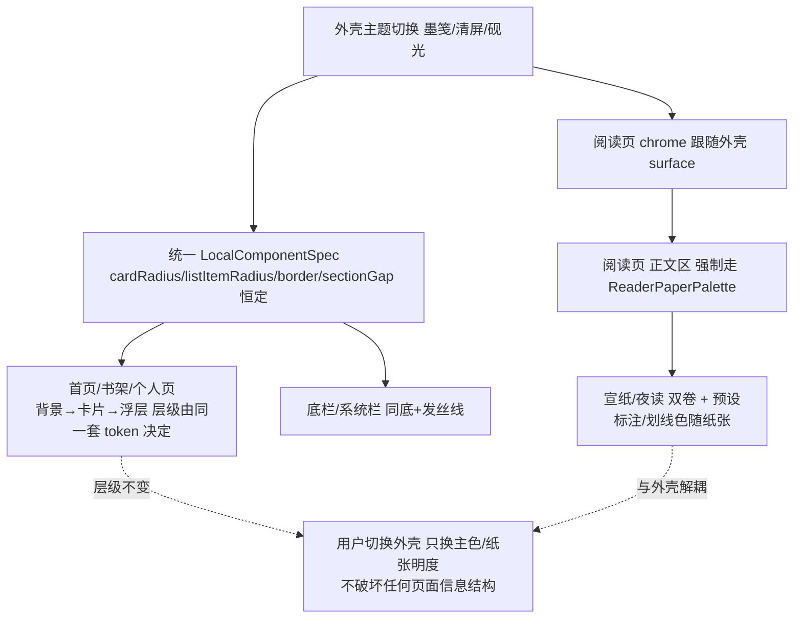

# 创作阅读助手 · 应用外壳主题与阅读器纸张视觉审查报告

> **审查范围与基调**：本次审计覆盖「墨韵·素笺 / Apple / 清新」三套已落地外壳主题 + 阅读器纸张现状（共 18 个文件代码级提取）。
> **结论基调**：三套外壳主题中 **Apple 与清新本质只是「同一套 Material3 骨架 + 不同 colorScheme/圆角档/阴影幅度」的换色变体，仅墨韵具备独立视觉语言**；且阅读器当前仅正文区用自有 `paperColors()` 硬编码纸张、工具栏/设置等 chrome 仍借用外壳 colorScheme，**缺少被正式 token 化的「独立阅读纸张体系」**。
>
> 本次为**纯审查**，未修改任何代码。

---

## A. 当前每个主题的问题清单（六维度）

> 严重度：高=切换主题即肉眼可见破坏信息层级/一致性；中=局部对比度或组件自成一派；低=细节未对齐 token。

### A.1 墨韵·素笺（DEFAULT）

| 维度 | 严重度 | 具体表现（引用真实 token / 组件） |
|---|---|---|
| 1. 层级 | 中 | 浅色 `background=Paper(#FAF8F2)` 与卡片 `cardContainer=Lowest→surfaceContainerLowest=#FFFFFF`（纯白）。白卡浮在近白宣纸底上，ΔL 极小，**卡片几乎只靠 `borderWidth=1.dp` + `outlineVariant=#D9D3C7` 发丝线分离**。深色更甚：`background=#141311` 与卡片 `Lowest→#0E0D0C` 都近黑，叠加以 `outlineVariant=#3A3733` 发丝线，dark 下层级几乎压平。 |
| 2. 对比度 | 中 | 浅色 `onSurfaceVariant=Muted(#76726A)` 落在 `surfaceVariant=Paper2(#F3EFE6)` 上时约 **4.1:1**，低于 WCAG AA 正文 4.5:1。大量 `bodySmall`/副标题用它写在纸面卡上（如 Shelf/Profile 的说明文字），属 borderline 失败。 |
| 3. 一致性 | **高** | **首页 `HomeScreen` 完全绕过 `LocalComponentSpec`**：`SummaryCard` 手写 `RoundedCornerShape(18.dp)+BorderStroke(1.dp,outline)+elevation 0`；`ContinueCard` 手写 `16.dp+1.dp 边框`；`GridStat` 手写 `8.dp`；`InspirationMiniCard` 用 `shapes.medium(10.dp)` 且 `elevation 1/4.dp`（与 spec 的 0 冲突）；`EmptyHint` 手写 `10.dp` 虚线框，未用 `EmptyStateHint`。→ 切到 Apple 时首页仍是 18.dp+1dp 边框，破坏 Apple 的「0 边框+大圆角+投影」语言。 |
| 4. 字体 | 低 | 唯一有真正字体策略的主题：Display/Headline 用 `FontFamily.Serif`（宋体），Title/Body/Label 用 `Sans`，正文 `bodyLarge=1.75` 行高对长文友好。无问题，反是标杆。 |
| 5. 形状/间距/边框/阴影 | 中 | `cardRadius=14`、扁平（`cardElevation=0/cardElevationAmbient=0`）、`borderWidth=1`、`dividerThickness=1`——自洽的「纸叠放」哲学，但**投影恒为 0** 使卡片在复杂页面里不如 Apple/清新有浮起感。 |
| 6. 浅/深同层级 | 中 | 深色调色板只是把纸墨反相（`PaperDark=#141311`/`InkDark=#F3EFE6`），未重新设计层次；浅色靠白卡+发丝线，深色同样靠发丝线但卡片与背景明度差更小，导致深色层级弱于浅色。 |

### A.2 Apple（APPLE）

| 维度 | 严重度 | 具体表现 |
|---|---|---|
| 1. 层级 | 低（反而最好） | `background=#F2F2F7`(冷灰) + `surface/cardContainer Lowest=#FFFFFF`(纯白) + `cardElevationAmbient=12.dp`，白卡在灰底上层次分明。但注意：**真正的「毛玻璃」观感并未生效**（见玻璃系统段落），所谓 Apple 当前只是「灰底+白卡+投影+方圆形」。 |
| 2. 对比度 | **高** | 浅色 `onSurfaceVariant=#8E8E93` 落在白卡上约 **3.25:1**，三级文字 `#AEAEB2` 约 2.6:1，**均低于 AA 正文 4.5:1**（仅过 UI/大字 3:1）。这是三套里最差的二级文字对比，且 CJK 小字最吃亏。 |
| 3. 一致性 | 中 | `GlassCard`/`GlassSurface` 的 rim/sheen/specular 叠加层因 `glassEnabled=false`（三套皆关）**永不绘制**，只剩普通 `Surface`；`GlassCard` 实质等同于 `SectionCard`，"Glass"命名误导。底栏/切换按钮对 Apple 单独换线性图标（`ic_*_line` vs Material 填充图标），属于「为模仿 iOS 而特判」的零散分支。 |
| 4. 字体 | 中 | 注释声称「SF 风格」，但 `FontFamily.Default` 在 Android 上实为 Roboto/Noto，**并非 SF**；全档用 Default，仅行高略紧（`bodyLarge=1.55`）。即「iOS 排版」是名义上的，无真实字体差异化；长文行高比墨韵(1.75)紧。 |
| 5. 形状/间距/边框/阴影 | 低 | `cardRadius=22`、`useSquircle=true`（唯一用 `SquircleShape`）、`borderWidth=0`、`dividerThickness=0.5`、`sectionGap=22`（最阔）。这些是真实差异化，但逻辑与墨韵/清新同构——同一套 `ComponentSpec` 字段，只是数值更大。 |
| 6. 浅/深同层级 | 低 | 深色调色板做了真实台阶（`#0E0E13`→`#1B1B22`→`#23232C`→`#2A2A34`→`#32323E`），层级在深色下保持得好。对比度深色无问题。 |

### A.3 清新（WEB）

| 维度 | 严重度 | 具体表现 |
|---|---|---|
| 1. 层级 | 低 | `background=#EAF3F0`(薄荷) + `surface=#FFFFFF` + `cardElevation=3/cardElevationAmbient=8`，薄荷底+白卡+轻投影，层次清楚。 |
| 2. 对比度 | 低（最好） | `onSurfaceVariant=#5A6B65` 落白卡约 **5.65:1**、落 `surfaceVariant(#F1F8F5)` 约 5.1:1，三套里最符合 AA。 |
| 3. 一致性 | 中 | 与 Apple 同理：`glassEnabled=false` 使其「Web 轻投影」仅靠 `cardElevation`+`ambient` 实现，无真正玻璃。组件层面基本接入 `SectionCard` 等，但 `Grep` 显示仍有手写 `RoundedCornerShape(11.dp/8.dp/4.dp/6.dp)`（书架封面/筛选 chip）未走 spec。 |
| 4. 字体 | 中 | `FontFamily.Default` 全档，行高 `bodyLarge=1.70` 居中（介于墨韵与 Apple 之间），无字体个性。 |
| 5. 形状/间距/边框/阴影 | 低 | `cardRadius=12`、`borderWidth=1`、`sectionGap=18`、`cardElevation=3+ambient8`——Web 招牌悬浮卡。与 Apple 同为「Material3+换色+不同幅度」。 |
| 6. 浅/深同层级 | 低 | 深色 `#0E1A17`→`#16241F`→`#22332D` 有台阶，层级保持良好。 |

### A.4 跨主题共性 & 玻璃系统现状

| 项 | 发现 |
|---|---|
| 毛玻璃实为「半成品/休眠」 | `GlassPalette` / `AppleGlassPalette` / `GlassShapes`(`GlassOverlays`) 中，`rim/sheen/specular` 仅在 `palette!=null && spec.glassEnabled` 时绘制；而三套 `ComponentSpec.glassEnabled` **全为 false** → 卡片玻璃叠加层**永不渲染**。`GlassDialogs.kt` 的 `glassWindowBlur(LocalGlassPalette.current!=null)` 仍可让 Apple 的 Dialog 在 API31+ 拿到真窗口模糊，但卡片无任何玻璃感。结论：**Apple 当前没有毛玻璃身份，只有 iOS 调色盘+方圆形+投影**。 |
| 三套阴影哲学互不统一 | 墨韵 `0/0`（纯平）、Apple `0/12`（仅环境光）、清新 `3/8`（键+环境）。这是「量级差异」而非「逻辑差异」，统一方向需收敛为一种可 token 化的层级策略。 |
| 首页是最大一致性破口 | 见 A.1-3（高）。`HomeScreen` 的 5 个私有卡片几乎全用手写半径/边框/投影，不消费 `LocalComponentSpec`，是「主题切换后外观不一致」的首要来源。 |

---

## B. 所有主题的颜色与排版 token 对照表

### B.1 颜色 token（真实 Hex，取自代码）

| Token | 墨韵 Light | 墨韵 Dark | Apple Light | Apple Dark | 清新 Light | 清新 Dark |
|---|---|---|---|---|---|---|
| `background` | `#FAF8F2` | `#141311` | `#F2F2F7` | `#0E0E13` | `#EAF3F0` | `#0E1A17` |
| `surface` | `#FAF8F2` | `#141311` | `#FFFFFF` | `#1B1B22` | `#FFFFFF` | `#16241F` |
| `surfaceVariant` | `#F3EFE6` | `#24221F` | `#E9EFF8` | `#26262F` | `#F1F8F5` | `#22332D` |
| `primary` | `#3A5670` | `#7C8FD6` | `#007AFF` | `#0A84FF` | `#0E9F96` | `#2DD4BF` |
| `onPrimary` | `#FAF8F2` | `#141311` | `#FFFFFF` | `#FFFFFF` | `#FFFFFF` | `#00302A` |
| `secondary` | `#3A5670` | `#7C8FD6` | `#007AFF` | `#0A84FF` | `#14B8A6` | `#34D0BC` |
| `onSurface` | `#1A1917` | `#F3EFE6` | `#1C1C1E` | `#FFFFFF` | `#14201D` | `#E6F2EE` |
| `onSurfaceVariant` | `#76726A` | `#8A847A` | `#8E8E93` | `#98989F` | `#5A6B65` | `#9DB5AD` |
| `outline` | `#76726A` | `#8A847A` | `#C6C6C8` | `#38383A` | `#C9DDD6` | `#33473F` |
| `outlineVariant` | `#D9D3C7` | `#3A3733` | `#DDE3EE` | `#34343F` | `#E0EDE8` | `#22332D` |
| `error` | `#B3261E` | `#E49B94` | `#FF3B30` | `#FF453A` | `#C2413A` | `#FF6B5E` |
| `surfaceContainerLowest`(卡片档) | `#FFFFFF` | `#0E0D0C` | `#FFFFFF` | `#23232C` | `#FFFFFF` | `#22332D` |
| `surfaceContainerLow` | `#FAF8F2` | `#171614` | `#FFFFFF` | `#23232C` | `#F1F8F5` | `#16241F` |
| `surfaceContainer` | `#F3EFE6` | `#1C1A18` | `#E3ECF8` | `#2A2A34` | `#E7F1ED` | `#22332D` |
| `surfaceContainerHigh` | `#EDE8DD` | `#24221F` | `#DCE6F5` | `#32323E` | `#DDE9E4` | `#22332D` |
| `surfaceContainerHighest` | `#E8E2D7` | `#2E2B27` | `#DCE6F5` | `#32323E` | `#D3E1DC` | `#22332D` |
| `surfaceBright` | `#FDFCF8` | `#3A3733` | `#FFFFFF` | `#2C2C2E` | `#FFFFFF` | `#22332D` |
| `surfaceDim` | `#E5E0D6` | `#141311` | `#F2F2F7` | `#000000` | `#EAF3F0` | `#0E1A17` |
| `inverseSurface` | `#1A1917` | `#F3EFE6` | `#1C1C1E` | `#FFFFFF` | `#14201D` | `#E6F2EE` |
| `primaryContainer` | `#DDE3EA` | `#2A3446` | `#007AFF@12%` | `#0A2A4D` | `#D6F0EC` | `#0A4A42` |
| `onPrimaryContainer` | `#2A4054` | `#C5D0F0` | `#007AFF` | `#7CC4FF` | `#06403C` | `#7FF0E0` |
| `tertiary` | `#5A7A94` | `#5A7A94` | `#5AC8FA` | `#5AC8FA` | `#4A9B8E` | `#6FD0C0` |
| **语义强调（非 MD3 角色）** | `AppCinnabar=#9E3D32`（仅印章）、`AppSuccess=#4A6E3F` | 同左 | 无独立语义色 | 无 | 无 | 无 |

> 注：墨韵独有 `AppCinnabar`(朱砂，仅 `SealMark`「读毕」印)、`AppSuccess/AppWarning/AppError`；Apple/清新未定义等价语义强调色，直接挪用 `primary`/错误红。

### B.2 组件级 token（ComponentSpec，真实 dp / 布尔）

| Token | 墨韵 | Apple | 清新 |
|---|---|---|---|
| `cardRadius` | 14.dp | 22.dp | 12.dp |
| `sheetRadius` | 18.dp | 26.dp | 20.dp |
| `pillRadius` | 999 | 999 | 999 |
| `listItemRadius` | 10.dp | 16.dp | 10.dp |
| `useSquircle` | false | **true** | false |
| `glassBlur` | false | false | false |
| `glassEnabled` | false | false | false |
| `pressScale` | 0.96 | 0.96 | 0.96 |
| `cardElevation`(键阴影) | **0** | **0** | 3 |
| `cardElevationAmbient`(环境光) | **0** | **12** | 8 |
| `borderWidth` | 1.dp | **0** | 1.dp |
| `borderSubtle` | true | true | true |
| `dividerThickness` | 1.dp | **0.5.dp** | 1.dp |
| `cardContainer` | Lowest | Lowest | Lowest |
| `contentPadding` | 18.dp | 18.dp | 18.dp |
| `sectionGap` | 16.dp | 22.dp | 18.dp |
| `listItemGap` | 12.dp | 14.dp | 12.dp |

### B.3 排版与形状 token

| Token | 墨韵 | Apple | 清新 |
|---|---|---|---|
| 标题字族(Display/Headline) | **Serif（宋体）** | Default | Default |
| 正文字族(Title/Body/Label) | Sans | Default | Default |
| `bodyLarge` (size/行高) | 16 / 1.75 | 16 / 1.55 | 16 / 1.70 |
| `bodyMedium` | 14 / 1.70 | 14 / 1.50 | 14 / 1.65 |
| `bodySmall` | 13 / 1.65 | 13 / 1.46 | 13 / 1.60 |
| `headlineSmall` | Serif 19/1.40 | Default 19/1.34 | Default 19/1.38 |
| `labelSmall` 字距 | 0.1sp | 0.08sp | 0.08sp |
| Shapes xs/sm/md/lg/xl | 3/6/10/14/20 | 8/12/16/20/26 | 4/8/12/14/20 |

### B.4 阅读器纸张专项表（铁律 #1 核查）

| 项 | 现状（代码事实） |
|---|---|
| 纸张配色来源 | `ReaderScreen.kt` 内私有 `paperColors(bg): Pair<Color,Color>`，**硬编码 map**，与外壳 theme 解耦。默认 `"warm"`。 |
| 预设清单（背景 / 正文） | `white #FAFAF8 / #1A1A1A`；`warm #F3E8D8 / #2B2118`（默认）；`green #E8F0DF / #1F291A`；`night #1A1614 / #E8DDD0`；`warm-yellow #F7F0D8 / #3D2B1F`；`green-bean #E8F0E0 / #2D332B`；`oled-black #000000 / #B8B0A8`。 |
| 阅读器 chrome 用色 | **工具栏、TTS 面板、设置/目录/笔记弹层、AI 面板仍用外壳 `MaterialTheme.colorScheme`**（Grep 命中大量 `MaterialTheme.colorScheme.surface/outlineVariant/primary`）。即：仅「正文文字列」独立，阅读器外壳仍是墨韵/Apple/清新。 |
| 标注/划线色 | `highlightColor()` 硬编码浅彩：`yellow #FFF176 / red #FF8A80 / green #B9F6CA / blue #90CAF9 / purple #E1BEE7`，**三主题通用、不随纸张深浅自适应**；在深色纸（night/oled）上对比靠运气。 |
| 句/段高亮 | `sentenceHighlightBg = MaterialTheme.colorScheme.primary.copy(alpha=0.22f)`——借用外壳主色，纸张切换时高亮色会变。 |
| 结论 | **部分满足铁律 #1**：正文纸张独立，但 (a) 未 token 化为正式「阅读纸张体系」、(b) 阅读器 chrome 仍绑外壳、(c) 标注色不随纸张。应建立独立的 `ReaderPaperPalette`（见 E/F）。 |

---

## C. 哪些主题只是换色、缺乏独立设计逻辑

**判定依据（对照 B 表差异度）：**

| 主题 | 是否「同一套 Material3 骨架 + 换色」 | 独立设计逻辑证据 | 结论 |
|---|---|---|---|
| **墨韵·素笺** | 否（有条件） | ① 唯一用 **Serif 标题（宋标黑文）** 的字体策略；② 唯一定义**语义强调色体系**（朱砂仅印章、靛青仅主色，且有明确「不滥用」纪律）；③ 扁平「纸叠放」哲学（`elevation=0`+发丝线）自洽；④ 调色盘源自自有 `md3-base.css` 纸墨语义。 | **具备独立视觉语言**，应作为品牌基线。 |
| **Apple** | **是** | 仅 `useSquircle`+更大圆角+0 边框+0.5 分割线+环境投影+iOS 调色盘；字体仍是 `Default`（非 SF）；毛玻璃休眠。这些是「量级差异」，逻辑与墨韵/清新同构。且**直接模仿 iOS**（用户明令禁止）。 | **本质换色 + iOS 模仿**，独立语言最弱。 |
| **清新** | **基本是** | 仅把主色换成 teal、背景换薄荷、投影换 Web 档；形状/字体/组件逻辑与另两套无区别。无自创语义。 | **换色变体**，无深刻独立语言，但调性最中性、对比度最好。 |

> **一句话**：三套共享同一个 `ComponentSpec`/`MaterialTheme` 骨架；墨韵靠「宋体+纸感+语义色纪律」真正立住了语言，Apple 与清新只在 colorScheme、圆角幅度、阴影幅度上做差异化——属「换色」，其中 Apple 还叠了「仿 iOS」的硬伤。

---

## D. 建议删除 / 合并 / 保留哪些主题

### D.1 三套的处理建议

| 主题 | 建议 | 理由 |
|---|---|---|
| **墨韵·素笺** | **保留并升格为唯一「品牌基线」** | 唯一有独立语言；承载「创作阅读助手」的文人纸感主张。后续统一方向应从它演化，而非另起炉灶。 |
| **Apple** | **删除（或降级为内部验证用例）** | ① 用户铁律「不要模仿 Apple」；② 其「毛玻璃」身份当前休眠，实际只是 iOS 调色盘+方圆形；③ 二级文字对比度三套最差（3.25:1）。保留它等于长期背着「仿 iOS」的债。若团队舍不得方圆形手感，可把「方圆形+环境投影」作为统一方向里的一个**形状选项**吸收，而非独立主题。 |
| **清新** | **合并进统一体系，作为「浅色的一个清爽调性」或弃用** | 它唯一的长处（薄荷底、好对比度、Web 轻投影）可被统一方向吸收为「浅色调色板变体」。建议不保留为独立主题，避免「三套各说各话」。 |

### D.2 暂停的 4 套（水墨韵 / 赛博朋克 / 极简纸感 / 国风古籍）如何处置

- **不要**在「统一方向确定前」落地任何一套——否则只是在已有混乱上再加一套换色。
- 统一方向敲定后，按以下口径重建：
  - **国风古籍 / 水墨韵**：与墨韵同宗，应直接并入「墨笺」方向的**纸张预设**（如古籍宣纸、水墨灰），而非独立外壳主题。
  - **极简纸感**：并入统一方向的「留白/极简」形状与间距档（小圆角、少投影、大留白），作为**参数档**而非主题。
  - **赛博朋克**：与「创作阅读助手」的文人纸感主张冲突最大，建议**不入主线**；若未来要做「暗夜模式特辑」，以统一深色体系的「砚光暗卷」预设形式出现，而不是一套花哨外壳。
- 总原则：**外壳主题数量收敛到 1 套品牌基线 + 若干「调色板/纸张预设」**，而不是 N 套互不相关的主题。

### D.3 推荐收敛目标

> **外壳主题：1 套「墨笺」品牌语言（含浅/深双卷）+ 可切换的「调色板预设」（如暖墨/清屏/砚光，仅换主色与纸张明度，不动形状与组件逻辑）。**
> **阅读纸张：独立 `ReaderPaperPalette`，与外壳解耦，自带浅/深双卷 + 多纸张预设（宣纸/古籍/夜读）。**

---

## E. 统一方向（北极星，最多 3 个）

> 三个方向都**不模仿 Apple / Material / 某网站**，而是从「创作阅读助手 = 文人纸感 + 长文沉浸」这个产品内核长出来。每个方向含：浅色外观、深色外观、独立阅读纸张、token 草案。

### 方向一 ·「墨笺」—— 文人纸系（**推荐为品牌基线**）

**视觉语言主张**：以「笺纸」为母题——暖宣纸作底，墨色作字，靛青印章作唯一主色，宋体标题配黑体正文（宋标黑文）。卡片是「叠放的纸」，不是「浮起的玻璃」：靠发丝线与极轻纸影分层，不靠重投影。这是当前墨韵的进化版，把它的长处制度化、把弱点（白卡贴纸底、深色压平）修掉。

- **默认浅色**：页面底=`#F7F3EA`（比现宣纸略深一档，给白卡让出明度差）；卡片=`#FFFFFF` 或 `#FCFBF6` 纸白；浮层=`#FFFFFF`+`elevationAmbient 4dp`；导航栏=`surface` 与底分一档发丝线；系统栏同底。**主色=`#3A5670` 靛青**，点缀仅朱砂 `#9E3D32`（仅「读毕」类完成态）。形状：卡片 `14dp`、列表项 `10dp`、弹层 `20dp`、胶囊 `999`；边框 `1dp` 发丝线；**统一轻纸影 `cardElevation 0 / ambient 4dp`**（取代现墨韵的 0/0，修复层级）。字体：标题 Serif、正文 Sans、`bodyLarge 16/1.75`。
- **默认深色（重新设计，非反相）**：命名为「墨夜」。底=`#15140F`（近黑带暖）、卡片=`#1F1D17`（比底亮一档，靠明度差分层而非边框）、浮层=`#24211A`+`ambient 6dp`；系统栏同底。**主色提亮=`#8AA6D8`** 保对比。二级文字 `#9A938A` 落卡片≈5:1。深色下用「暖墨叠层」而非「发丝线」做分离——这是与浅色不同的层次策略（浅色靠线、深色靠明度台阶）。
- **阅读器独立纸张（与外壳解耦）**：
  - 浅卷·宣纸：`bg #F3E8D8` / `fg #2B2118` / `accent #3A5670` / 标注黄 `#E8C97A`(降饱和暖黄，适配纸)、划线与背景对比≥4.5:1。
  - 深卷·夜读：`bg #1A1614` / `fg #E8DDD0` / `accent #8AA6D8` / 标注 `#6B5A3A`(暗金)。
  - 预设可扩展：古籍（米黄更浓）、冷白。标注/划线色**随纸张预设切换**，不再硬编码。

### 方向二 ·「清屏」—— 留白纸系（现代克制版）

**视觉语言主张**：把墨笺「暖」收一档，变成更中性的「读书人书桌」：单一暖中性纸、一个主色、克制小圆角、极少投影、大留白。它比 Apple 更「暖」、比 Material 更「中文」——靠 CJK 优化的字距与行高（不是 Roboto 那套）和一贯的小圆角建立识别，而不是 iOS 蓝灰或某网站薄荷绿。

- **默认浅色**：底=`#F4F1EA` 中性暖白；卡片=`#FFFFFF`；浮层=`#FFFFFF`+`ambient 6dp`；导航栏发丝线分隔。主色=`#2F6F63`（墨绿，介于靛青与 teal 之间，避免「像 Web 的薄荷」也避免「像 iOS 蓝」）。形状统一 `cardRadius 14 / listItem 10 / sheet 20`，**全主题恒定**（不再 14/22/12 三套）。边框 `1dp` 但更淡；间距 `sectionGap 20 / listItemGap 12`（统一呼吸感）。字体：仅 Display 用 Serif，其余 Sans，`bodyLarge 16/1.72`。
- **默认深色**：底=`#121310`；卡片=`#1C1B17`；浮层=`#232119`+`ambient 8dp`；主色=`#5FB0A2`。二级文字 `#9C988E` 落卡片≈5:1。深色同样靠明度台阶分层。
- **阅读器纸张**：与方向一同构（宣纸/夜读双卷 + 预设），主色随外壳主色微调但纸张明度独立。

### 方向三 ·「砚光」—— 轻立体纸系（纸感 + 一致光感）

**视觉语言主张**：承认现代 OLED 屏需要一点「浮起」来建立层级，于是把墨韵的扁平与 Apple/清新的浮起**收敛成一套统一的轻光语言**：纸张依旧暖、依旧有发丝线，但所有「浮起的元素」（卡片、浮层、底栏）共享**同一个环境光台阶**，不再出现墨韵(0)、Apple(12)、清新(8) 三套混乱。识别点 = 「暖纸 + 一致柔光 + 宋标」。

- **默认浅色**：底=`#F6F2E9`；卡片=`#FFFFFF`+`ambient 6dp`（**统一值**）；浮层=`#FFFFFF`+`ambient 10dp`；导航栏=`surface` 一档+发丝线。主色=`#3A5670` 靛青（与墨笺一致，保品牌）。形状 `cardRadius 16 / listItem 12 / sheet 22`（比墨笺略圆，接一点现代感）。边框 `0.75dp` 极淡；`sectionGap 18`。字体同墨笺（Serif 标题）。
- **默认深色**：底=`#14130F`；卡片=`#1E1C16`+`ambient 8dp`；浮层=`#26231B`+`ambient 12dp`；主色=`#8AA6D8`。深色下光感比浅色更强一档（屏更黑，需更明显浮起），但**台阶比例恒定**（如 浅:深 = 6:8、10:12）。
- **阅读器纸张**：同方向一（宣纸/夜读双卷），标注色随纸张。

> **三方向差异点对照**：墨笺=最扁最文人（ambient 4）、清屏=最中性现代（主色墨绿、仅 Display 宋）、砚光=最立体一致（统一光台阶、略圆）。三者共享「暖纸+发丝线+宋标+独立阅读纸张」的内核，区别只在**浮起强度与主色取向**——这正是应该被「token 化」的差异，而非再拆成 N 套主题。

---

## F. 书架页 / 阅读页 / 首页 / 个人页 的同内容对比方案

> 以下以**方向一「墨笺」**为基准规范（方向二/三仅浮起强度与主色不同，表中标注差异点）。核心原则：**外壳主题切换时，四页面靠同一套 `LocalComponentSpec` + 统一 token 保持信息层级不变；阅读页正文区靠独立 `ReaderPaperPalette` 与外壳解耦。**

### F.1 四页面统一规范（墨笺方向）

| 页面 | 背景层级 | 卡片/列表项 | 主/次文字 | 关键组件 | 圆角/间距取值 |
|---|---|---|---|---|---|
| **首页** | 页面底 `#F7F3EA`；区块卡 `#FFFFFF`/`#FCFBF6`；浮层 `#FFFFFF`+ambient4 | 全部改用 `SectionCard`；双卡/继续读卡/灵感卡不再手写半径 | 主=`onSurface`(墨 `#1A1917`)；次=`onSurfaceVariant`(≥4.5:1) | `SummaryCard/ContinueCard/GridStat/EmptyHint` 全部接入 spec；`ThemeSwitchButton` 保留 | card `14` / listItem `10` / sheet `20`；sectionGap `16`；contentPad `18` |
| **书架** | 同首页底；网格/列表书卡=`surface` 一档 | 书卡用 `SectionCard` 变体；封面角走 `listItemRadius`；筛选用 `SelectablePill` | 主=书名 `onSurface`；次=作者/格式 `onSurfaceVariant` | `SectionCard`/`SelectablePill`/`SettingRow`/`SheetHandle`/`SectionDivider` | 消灭手写 `11/8/4/6dp`，统一 `listItem 10`；进度条 `2dp` 保留为语义微元素 |
| **阅读页** | **正文区=`ReaderPaperPalette`（宣纸 #F3E8D8），与外壳底解耦**；阅读器 chrome(工具栏/设置)=外壳 `surface` | 正文列独立纸张；目录/笔记/AI 弹层=外壳 `SectionCard`+`SheetHandle` | 正文=`paper.fg`；chrome 文字=外壳 `onSurface/Variant` | 标注/划线=`paper.annotation`（随纸张）；句高亮=`paper.accent@0.2` | 正文区无卡片圆角（满版纸）；弹层 `sheet 20` |
| **个人页** | 同首页底 | 设置组=`SectionCard`；开关行=`SettingRow`；标签=`SelectablePill` | 主=标题 `onSurface`；次=说明 `onSurfaceVariant` | `SectionCard`/`SettingRow`/`SectionDivider`/`Switch` | 同首页规范 |

### F.2 信息层级一致性 & 阅读页解耦（Mermaid）



### F.3 四页面布局示意（ASCII，墨笺方向）

```
首页 (Home)                        书架 (Shelf)
┌─────────────────────────┐        ┌─────────────────────────┐
│ [标题]            [🌓切换]│        │ [书架]        [🔍][＋]  │
├─────────────────────────┤        ├─────────────────────────┤
│ ┌─────┐ ┌─────┐        │        │ ▸ SectionCard(同步进度)  │
│ │书 12│ │时 3h│ 双卡   │        │ ┌────┐┌────┐┌────┐     │
│ └─────┘ └─────┘        │        │ │封面││封面││封面│ 网格 │
│ 继续阅读 ›                    │        │ └────┘└────┘└────┘     │
│ [继续卡][继续卡][继续卡] 横滑 │        │ (SelectablePill: 全部/在读)│
│ 阅读统计                      │        │ ▸ SectionCard(本书详情)  │
│ [本][读][完][今] 网格       │        └─────────────────────────┘
│ 最近灵感                      │
│ ┌─────────────────────┐   │   个人 (Profile)
│ │灵感卡(SectionCard)   │   │   ┌─────────────────────────┐
│ └─────────────────────┘   │   │ [头像] 昵称 本地优先     │
└─────────────────────────┘   │   ├─ SettingRow 外观       │
  阅读 (Reader)                │   ├─ SettingRow 同步       │
┌─────────────────────────┐   │   ├─ SectionCard 标签管理 │
│ [‹] 书名        [⋯设置] │   │   └─ SectionCard 关于     │
│                         │   └─────────────────────────┘
│   宣纸正文区(paper.fg) │   阅读页正文区 = ReaderPaperPalette
│   长文沉浸 行高1.75    │   chrome(顶栏/设置) = 外壳surface
│   标注随纸张 accent     │
└─────────────────────────┘
```

### F.4 方向间差异点（若采用多方向）

| 维度 | 墨笺 | 清屏 | 砚光 |
|---|---|---|---|
| 主色 | `#3A5670` 靛青 | `#2F6F63` 墨绿 | `#3A5670` 靛青 |
| 浮起 | ambient 4dp（最扁） | ambient 6dp | ambient 6/10dp（最立体） |
| 圆角 | 14/10/20 | 14/10/20 | 16/12/22（略圆） |
| 宋体范围 | 标题全用 Serif | 仅 Display Serif | 标题全用 Serif |
| 底色 | 暖宣纸 `#F7F3EA` | 中性暖白 `#F4F1EA` | 暖宣纸 `#F6F2E9` |

> 切换外壳主题时，上述四页面**只变主色/纸张明度/浮起强度**，卡片结构、文字层级、圆角档位、组件形态**全部不变**——这是统一方向相对现状（首页自成一派、Apple 换 iOS 图标/方圆形）的根本改进。

---

## 附：关键风险与下一步建议（供主理人决策）

1. **最高优先修「首页一致性」**（A.1-3 高）：把 `HomeScreen` 五个私有卡片改为消费 `SectionCard`/`EmptyStateHint`/`LocalComponentSpec`，否则任何外壳切换在落地页都「看起来没切换」。
2. **建立 `ReaderPaperPalette` 正式 token**（铁律 #1）：把 `ReaderScreen.paperColors()` 提升为独立模块，阅读 chrome 与正文彻底分层，标注/划线色随纸张预设。
3. **收敛外壳主题到「墨笺 + 调色板预设」**，弃用 Apple（仿 iOS 硬伤 + 最差对比度）、合并清新（仅作清爽预设）。
4. **休眠的玻璃系统**（GlassOverlays / AppleGlassPalette 高光层）要么在统一方向里正式启用并 token 化，要么删除，避免「名为 Glass 实则无玻璃」的误导。
5. **统一阴影哲学**：将三套 `cardElevation/cardElevationAmbient` 收敛为一档（如方向三的恒定台阶），写进统一 `ComponentSpec`。

— 报告完 —
