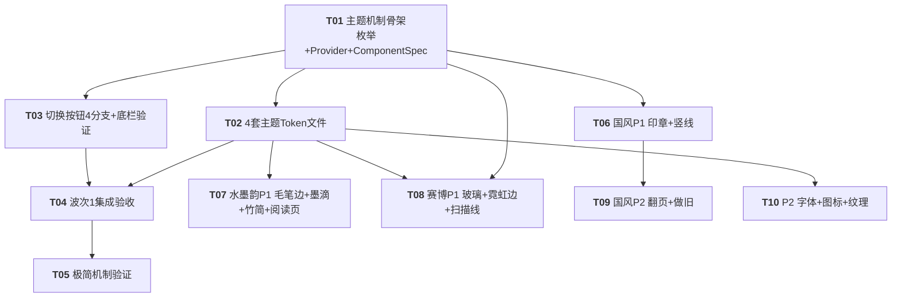

# 创作阅读助手 · 新增 4 套视觉主题 — 系统架构设计 + 任务分解

> 架构师：高见远（Gao）｜ 技术栈：Android（Kotlin 2.0.21 + Jetpack Compose 1.7.0 + Material3 + Hilt）
> 依据：许清楚 PRD `docs/PRD_add_four_visual_themes.md` + 现有主题机制源码 + 长期记忆 `MEMORY.md`
> 原则：**完全复用既有主题机制、Token 驱动、不破坏现有 3 套、零改 7 个共享组件本体**

---

## 1. 实现方案 + 框架选型

### 1.1 核心结论

| 项 | 结论 |
|---|---|
| 是否引入新框架 | **否**。完全复用现有 `VisualStyle` + `resolveThemeParams` + `componentSpecForStyle` + `VisualStyleProvider` + `LocalComponentSpec/LocalVisualStyle/LocalGlassPalette` 机制 |
| 是否改动 7 个共享组件 | **否**（`SectionCard/GlassCard/SelectablePill/SettingRow/SectionDivider/SheetHandle/EmptyStateHint`）。4 套新 `ComponentSpec` 注入后自动适配 |
| `ComponentSpec` 是否加字段 | **否**。4 套观感全部命中现有字段；赛博朋克「外发光」用 `glassEnabled=true` + 霓虹色 `CyberpunkGlassPalette` 命中既有 `GlassSurface` 叠加层路径；竖线/毛笔边/墨滴/扫描线/印章走**独立自定义组件** |
| 新增 gradle 依赖 | **无**。所有自定义组件用纯 Compose `Canvas / Drawable / GraphicsLayer / Indication` 实现 |
| 字体 | 默认**不内置字体文件**，全用系统字族（`Serif`/`Monospace`/`Default`）；内置书法体/等宽体仅 P2 可选 |

### 1.2 4 主题如何注入（注入点总览）

每个新主题 = **1 枚举项 + 1 套 `ColorScheme`(Light/Dark) + 1 个 `Typography` + 1 套 `Shapes` + 1 个 `ComponentSpec` 实例**，全部经既有分发表注入：

| 接入点 | 动作 |
|---|---|
| `VisualStyle.kt` | 枚举新增 `INK_WASH / CYBERPUNK / MINIMAL / CLASSIC` |
| `ThemeProvider.kt` | `resolveThemeParams()` 增 4 分支；`LocalGlassPalette` 仅 `CYBERPUNK` 提供 `CyberpunkGlassPalette`，其余 `null` |
| `ComponentSpec.kt` | 新增 4 个实例 + `componentSpecForStyle()` 增 4 分支（**数据结构不变**） |
| `*Theme.kt`（4 个新文件） | 各持 `Light/Dark ColorScheme` + `Typography` + `Shapes`（仿 `AppleTheme.kt`/`WebTheme.kt` 写法） |
| `ThemeSwitchButton.kt` | `displayName()` / `accentPreview()` 穷尽 `when` 补 4 分支（**否则编译不过**） |
| `AppNavigation.kt` | **无需改动**（非 `APPLE` 走 `else` 普通 `Scaffold` 底栏，新主题自然命中） |

### 1.3 关键技术难点与对策

| 难点 | 对策 |
|---|---|
| 赛博朋克「暗色专属 + 霓虹外发光」 | `darkTheme` 真/假都返回暗色方案；`glassEnabled=true` + `CyberpunkGlassPalette`（霓虹色 `GlassTokens`）→ 复用 `GlassSurface` 现有 rim/sheen/specular 叠层即得「通电」观感，`borderWidth=0` |
| 水墨韵 / 极简 / 国风 明+暗双方案 | 复用 `resolveThemeParams(style, darkTheme)` 的 `darkTheme` 分支，各持 Light/Dark `ColorScheme`，系统切暗色不丢失辨识度 |
| 阅读页（水墨纸感 P1 / 国风翻页做旧 P2）触及阅读核心 | **只换皮不换引擎**：仅覆盖 `ReaderScreen` 背景色/正文色或叠加独立 Overlay 层；绝不改动 `EpubParser`、章节懒加载、内存管理；上线前 `logcat` 验证无 ANR/OOM（256MB 堆上限） |
| 自定义组件如何取得主题令牌 | 自定义组件**必须消费 `LocalComponentSpec` 取圆角/描边**（禁硬编码魔法数字），并按需读 `LocalVisualStyle` 做主题分支 |

---

## 2. 文件列表及相对路径

### 2.1 新增主题 Token 文件（每套 1 个，持有 Light/Dark ColorScheme + Typography + Shapes）

| 文件 | 内容 |
|---|---|
| `android/app/src/main/java/com/creationreadingassistant/ui/theme/InkWashTheme.kt` | `InkWashLightColorScheme` / `InkWashDarkColorScheme` / `InkWashTypography`(标题 Serif) / `InkWashShapes` |
| `android/app/src/main/java/com/creationreadingassistant/ui/theme/CyberpunkTheme.kt` | `CyberpunkDarkColorScheme`(暗色专属) / `CyberpunkTypography`(Monospace) / `CyberpunkShapes` + `CyberpunkGlassPalette` |
| `android/app/src/main/java/com/creationreadingassistant/ui/theme/MinimalTheme.kt` | `MinimalLightColorScheme` / `MinimalDarkColorScheme` / `MinimalTypography`(Default 靠字重) / `MinimalShapes` |
| `android/app/src/main/java/com/creationreadingassistant/ui/theme/ClassicTheme.kt` | `ClassicLightColorScheme` / `ClassicDarkColorScheme` / `ClassicTypography`(标题 Serif) / `ClassicShapes` |

> 注：`CyberpunkGlassPalette` 直接写在 `CyberpunkTheme.kt` 内（它是 `LiquidGlassPalette` 的霓虹色实例，复用 `GlassSurface` 路径，无需独立文件）。

### 2.2 新增自定义组件文件（按 P1/P2 标注，**均消费 `LocalComponentSpec` 取圆角/描边，禁硬编码**）

建议新建独立包 `android/app/src/main/java/com/creationreadingassistant/ui/components/effects/`（与 7 个共享基组件隔离，便于管理「超出 Token 能力」的观感）：

| 文件 | 归属主题 | 优先级 | 说明 |
|---|---|---|---|
| `effects/BrushBorder.kt` | 水墨韵 + 赛博朋克 | **P1** | 毛笔手绘边（`Ink` 变体）/ 霓虹渐变描边（`Neon` 变体），包裹 `SectionCard` 等 |
| `effects/InkDropIndication.kt` | 水墨韵 | **P1** | 自定义 `Indication`（墨滴扩散），替换默认 ripple |
| `effects/ScanLineOverlay.kt` | 赛博朋克 | **P1** | 悬停/点击扫过的扫描线叠加层 |
| `effects/SealButton.kt` | 国风古籍 | **P1** | 朱红/烫金印章按钮 + 按压「钤印」反馈 |
| `effects/ClassicVerticalDivider.kt` | 国风古籍 | **P1** | 古籍页边竖线分割（替换横向 `SectionDivider`） |
| `effects/BambooDivider.kt` | 水墨韵 | **P1** | 竹简纹路分割线 |
| `effects/PageFlipTransition.kt` | 国风古籍 | **P2** | 阅读页翻页过渡（仅阅读容器） |
| `effects/AgedPaperOverlay.kt` | 国风古籍 | **P2** | 阅读页做旧滤镜叠加层（仅阅读容器） |

> 极简纸感（③）**零新组件**：纯 `ComponentSpec` 驱动；P1 仅做机制验证 + 图标中性灰 tint（复用现有 `ic_*_line`）。

### 2.3 改动文件清单（既有点，精准增量）

| 文件 | 改动性质 | 是否动数据结构 |
|---|---|---|
| `ui/theme/VisualStyle.kt` | 枚举 +4 项 | 否（仅枚举扩展） |
| `ui/theme/ThemeProvider.kt` | `resolveThemeParams` +4 分支；`LocalGlassPalette` 增 `CYBERPUNK` 分支 | 否 |
| `ui/theme/ComponentSpec.kt` | +4 实例 + `componentSpecForStyle` +4 分支 | **否（data class 不变）** |
| `ui/components/ThemeSwitchButton.kt` | `displayName()` / `accentPreview()` +4 分支 | 否 |
| `ui/navigation/AppNavigation.kt` | **无需改动**（新主题已命中 `else` 普通底栏 + Material 图标自动吃 `scheme.primary`）；仅做验证标注 | 否 |
| `ui/screen/ReaderScreen.kt` | 仅 P1（水墨纸感背景覆盖）与 P2（翻页/做旧叠加）触及，且**只换皮不换引擎** | 否 |

---

## 3. 数据结构和接口（类图）

完整 Mermaid 类图见 `docs/class-diagram.mermaid`。要点：

- **`ComponentSpec` 现有字段已 100% 覆盖 4 套需求**（见下表对照），故 `data class` **不加字段**，共享组件零改。
- **`CyberpunkGlassPalette` 是 `LiquidGlassPalette` 的霓虹色实例**（复用 `GlassSurface` 既有叠加层，零新逻辑）。
- 自定义组件为独立 `@Composable` / `Indication`，通过 `LocalComponentSpec`、`LocalVisualStyle`、`LocalGlassPalette` 取令牌。

### 3.1 `ComponentSpec` 字段 × 4 新主题对照（证明无需加字段）

| 字段 | 水墨韵 | 赛博朋克 | 极简 | 国风 | 现有？ |
|---|---|---|---|---|---|
| `cardRadius` | 16dp | 12dp | 8dp | 12dp | ✅ |
| `listItemRadius` | 12dp | 10dp | 6dp | 10dp | ✅ |
| `borderWidth` | 1dp(淡) | 0(霓虹替) | 1dp | 1dp(金) | ✅ |
| `cardElevation` | 0 | 0 | 0 | 0 | ✅ |
| `cardElevationAmbient` | 0 | 8dp(发光) | 0 | 0 | ✅ |
| `glassEnabled` | false | **true** | false | false | ✅ |
| `glassTint` | 1f | 0.82 | 1f | 1f | ✅ |
| `dividerThickness` | 1dp | 1dp | 1dp | 1dp | ✅ |
| `cardContainer` | Lowest | Variant | Lowest | Low | ✅ |
| `sectionGap` | 16dp | 14dp | **24dp** | 16dp | ✅ |
| `contentPadding` | 18dp | 16dp | 20dp | 18dp | ✅ |
| `pressScale` | 0.96 | 0.98 | 0.99 | 0.97 | ✅ |

> 赛博朋克「外发光」= `glassEnabled=true` + 霓虹色 `CyberpunkGlassPalette` → 命中 `GlassSurface` 既有 rim/sheen/specular 路径（`GlassOverlays` 已存在）。
> 候选字段 `glowColor / dividerOrientation / brushBorder` **均不加入**：前两者可由 `GlassPalette` + 独立组件表达；`brushBorder` 若做成 `ComponentSpec` 布尔会自动包裹所有卡片，风险大且违反「共享组件零改」铁律，**改为显式 `BrushBorder` 装饰器**。

### 3.2 自定义组件关键 API 签名（伪代码级）

```kotlin
// ── BrushBorder：毛笔边(Ink) / 霓虹渐变边(Neon)，包裹任意内容 ──
enum class BrushBorderVariant { Ink, Neon }
@Composable
fun BrushBorder(
    variant: BrushBorderVariant = BrushBorderVariant.Ink,
    modifier: Modifier = Modifier,
    glowColor: Color? = null,          // Neon 变体辅助色，默认读 LocalComponentSpec / scheme.primary
    content: @Composable () -> Unit,
)

// ── InkDropIndication：墨滴扩散点击反馈（自定义 Indication）──
object InkDropIndication : Indication {
    @Composable
    override fun rememberUpdatedInstance(interactionSource: InteractionSource): IndicationInstance
}
// 用法：Modifier.clickable(indication = InkDropIndication, interactionSource = remember { MutableInteractionSource() }) { ... }

// ── ScanLineOverlay：赛博扫描线（悬停/点击激活）──
@Composable
fun ScanLineOverlay(active: Boolean, modifier: Modifier = Modifier, color: Color = MaterialTheme.colorScheme.primary)

// ── SealButton：朱红/烫金印章按钮 ──
enum class SealVariant { Red, Gold }
@Composable
fun SealButton(text: String, onClick: () -> Unit, modifier: Modifier = Modifier, variant: SealVariant = SealVariant.Red)

// ── ClassicVerticalDivider：古籍页边竖线 ──
@Composable
fun ClassicVerticalDivider(
    modifier: Modifier = Modifier,
    thickness: Dp = LocalComponentSpec.current.dividerThickness,
    color: Color = MaterialTheme.colorScheme.outline,
)

// ── BambooDivider：竹简纹路分割线 ──
@Composable
fun BambooDivider(modifier: Modifier = Modifier, thickness: Dp = LocalComponentSpec.current.dividerThickness)

// ── PageFlipTransition：阅读页翻页过渡（P2，仅阅读容器）──
@Composable
fun PageFlipTransition(flipped: Boolean, modifier: Modifier = Modifier, content: @Composable () -> Unit)

// ── AgedPaperOverlay：做旧滤镜叠加（P2，仅阅读容器）──
@Composable
fun AgedPaperOverlay(modifier: Modifier = Modifier, intensity: Float = 0.5f)

// ── CyberpunkGlassPalette：LiquidGlassPalette 霓虹色实例（写在 CyberpunkTheme.kt）──
val CyberpunkGlassPalette = LiquidGlassPalette(
    light = GlassTokens(highlightColor = Color(0xFF00E5FF), glassTintColor = Color(0xFF14141F), specularAlpha = 0.22f, blurRadius = 24.dp),
    dark  = GlassTokens(highlightColor = Color(0xFFB26BFF), glassTintColor = Color(0xFF0A0A12), specularAlpha = 0.20f, blurRadius = 28.dp),
)
```

---

## 4. 程序调用流程（时序图）

完整 Mermaid 时序图见 `docs/sequence-diagram.mermaid`。摘要：

1. 用户在 `ThemeSwitchButton` 选择 `INK_WASH` → `onStyleChange` 写入 `LocalVisualStyleState`（全局 `MutableState`）。
2. 快照系统驱动 `VisualStyleProvider` 重组。
3. `resolveThemeParams(style, isSystemInDarkTheme())` 返回对应 `ThemeParams`；`componentSpecForStyle(style)` 返回对应 `ComponentSpec`；`LocalGlassPalette` 仅 `CYBERPUNK` 提供 palette，其余 `null`。
4. `CompositionLocalProvider` 广播三 Local + `MaterialTheme` 重组子树。
5. **7 个共享组件读 `LocalComponentSpec.current`** 自动适配圆角/描边/底色/阴影 —— 零改。
6. 若某主题需自定义观感（国风印章/水墨毛笔边/赛博扫描线），在对应位置**包裹自定义组件**：自定义组件读 `LocalVisualStyle` 做主题分支、读 `LocalComponentSpec` 取圆角/描边。

---

## 5. 任务列表（有序、含依赖、按实现批次）

> 设计说明：本任务表按 PRD 推荐的三波次落地。通用「Architect 默认 ≤5 任务、首任务为项目脚手架」的规则面向**绿地 React 项目**；本任务是**既有 Android 模块**的增量主题化，无脚手架可建，且 `ThemeSwitchButton` 穷尽 `when` 强制 4 分支必须同批落地，故按波次拆为 10 个细粒度任务（每任务 ≥3 文件/逻辑单元，依赖关系明确）。

### 5.1 波次 1（P0 外壳，4 套并行）— 编译前提，必须整体交付

#### T01 · 主题机制骨架（枚举 + Provider + ComponentSpec 分发表）
- **源文件**：`VisualStyle.kt`、`ThemeProvider.kt`、`ComponentSpec.kt`
- **依赖**：无
- **优先级**：P0
- **内容**：枚举 +4 项；`resolveThemeParams()` +4 分支；`LocalGlassPalette` 增 `CYBERPUNK → CyberpunkGlassPalette` 否则 `null`；`ComponentSpec.kt` +4 实例（`InkWashComponentSpec`/`CyberpunkComponentSpec`/`MinimalComponentSpec`/`ClassicComponentSpec`）+ `componentSpecForStyle()` +4 分支。**`data class ComponentSpec` 不变。**
- **验收**：`./gradlew assembleDebug` 通过；4 主题在两张分发表均有分支；非赛博主题 `LocalGlassPalette=null`。

#### T02 · 4 套主题 Token 文件（Light/Dark ColorScheme + Typography + Shapes）
- **源文件**：`InkWashTheme.kt`、`CyberpunkTheme.kt`、`MinimalTheme.kt`、`ClassicTheme.kt`
- **依赖**：T01
- **优先级**：P0
- **内容**：仿 `AppleTheme.kt`/`WebTheme.kt` 写法。
  - 水墨韵/极简/国风：各持 `Light`+`Dark` `ColorScheme`（按 PRD §4.1/4.3/4.4 色板），标题字族 `Serif`（水墨/国风）或 `Default`（极简），`Shapes` 按 `cardRadius` 等。
  - 赛博朋克：`darkTheme` 真/假均返回 `CyberpunkDarkColorScheme`（暗色专属）；`CyberpunkTypography` 标题/数据 `Monospace`；内置 `CyberpunkGlassPalette`（霓虹色 `GlassTokens`）。
- **验收**：4 套 `ColorScheme` 编译通过；赛博朋克 `darkTheme=true/false` 同返暗色；`CyberpunkGlassPalette` 类型为 `LiquidGlassPalette`。

#### T03 · 切换按钮 4 分支 + 底栏验证
- **源文件**：`ThemeSwitchButton.kt`、`AppNavigation.kt`
- **依赖**：T01
- **优先级**：P0
- **内容**：`displayName()` 增 4 分支（建议：水墨 / 霓虹 / 素纸 / 古籍）；`accentPreview()` 增 4 分支（赭石红 `#A8432A` / 霓虹青 `#00E5FF` / 近黑 `#222222` / 烫金 `#C9A24B`）。`AppNavigation.kt` 经核对**无需改动**（新主题命中 `else` 普通 `Scaffold` 底栏 + Material 图标自动吃 `scheme.primary`）。
- **验收**：下拉含 7 档（3 旧 + 4 新），色点正确；**穷尽 `when` 编译通过**（不补 4 分支会编译失败，这是波次 1 的硬前提）。

#### T04 · 波次 1 集成验收（4 套可切换 + 共享组件适配）
- **源文件**：（集成/冒烟，无新文件；可补一个 `ThemeSwitchSmokeTest`）
- **依赖**：T02、T03
- **优先级**：P0
- **内容**：实机逐一切换 4 主题，确认首页/书架/灵感/统计/我的/设置/底栏全部随 `LocalComponentSpec` 重组；辨识度靠配色/圆角/描边/字体建立；确认现有 3 套未被破坏。
- **验收**：4 主题任意切换无崩溃；共享组件视觉随各 `ComponentSpec` 变化；现有 3 套外观零回归。

### 5.2 波次 2（P1 标志性动效）— 风险递增顺序：极简 → 国风 → 水墨韵 → 赛博朋克

#### T05 · 极简机制验证（零新组件）+ 图标中性灰 tint
- **源文件**：`AppNavigation.kt`（或新增 `ui/components/IconTint.kt` 工具）、复用 `ic_*_line`
- **依赖**：T04
- **优先级**：P1
- **内容**：确认 `MinimalComponentSpec`（纯白卡、`cardElevation=0`、`sectionGap=24dp`、`pressScale=0.99`、标题 `Default` 靠字重分层）已生效；图标复用 `ic_*_line` 按中性灰 tint（零新资源）。**本任务是机制验证样板，无新观感逻辑。**
- **验收**：极简主题纯白无阴影无渐变大留白、层级靠字重；无新增组件文件。

#### T06 · 国风 P1 — SealButton + ClassicVerticalDivider + 烫金描边
- **源文件**：`effects/SealButton.kt`、`effects/ClassicVerticalDivider.kt`（烫金描边由 `ComponentSpec.borderWidth/outline` 已驱动，无需改共享组件）
- **依赖**：T01
- **优先级**：P1
- **内容**：`SealButton`（朱红/烫金方形圆角 + 按压「钤印」反馈，圆角/描边读 `LocalComponentSpec`）；`ClassicVerticalDivider`（列表项间竖线，厚度读 `LocalComponentSpec.dividerThickness`，颜色读 `scheme.outline` 烫金）。
- **验收**：印章按钮视觉/按压反馈正确；竖线分割出现于列表；两组件均消费 `LocalComponentSpec`，无硬编码圆角/描边。

#### T07 · 水墨韵 P1 — BrushBorder(Ink) + InkDropIndication + BambooDivider + 阅读页纸感背景
- **源文件**：`effects/BrushBorder.kt`、`effects/InkDropIndication.kt`、`effects/BambooDivider.kt`、`ui/screen/ReaderScreen.kt`（局部覆盖）
- **依赖**：T02
- **优先级**：P1
- **内容**：`BrushBorder(Ink)` 包裹 `SectionCard` 呈毛笔手绘边；`InkDropIndication` 替换默认 ripple；`BambooDivider` 竹简纹路；**阅读页纸感背景**：仅覆盖 `ReaderScreen` 背景 `#F0E6D2`、正文 `#3B2F25`（PRD §4.1），**不动 EPUB 解析/懒加载/内存管理**。
- **验收**：毛笔边/墨滴/竹简分割生效；阅读页纸感仅换背景与文字色；`logcat` 验证无 ANR/OOM（256MB 堆上限）。

#### T08 · 赛博朋克 P1 — GlassSurface 复用 + CyberpunkGlassPalette + BrushBorder(Neon) + ScanLineOverlay
- **源文件**：`CyberpunkTheme.kt`（palette 已在 T02）、`effects/BrushBorder.kt`(Neon 变体)、`effects/ScanLineOverlay.kt`
- **依赖**：T01、T02
- **优先级**：P1
- **内容**：`glassEnabled=true` + 霓虹 `CyberpunkGlassPalette` → `GlassSurface` 既有 rim/sheen/specular 自动呈外发光（**零改共享组件**）；`BrushBorder(Neon)` 品红+青+紫渐变描边（替代 `borderWidth=0`）；`ScanLineOverlay` 悬停/点击扫过卡片。
- **验收**：玻璃态外发光呈现；霓虹渐变描边与扫描线动效正确；`GlassSurface` 逻辑未改，仅 palette 不同。

### 5.3 波次 3（P2 深度观感）

#### T09 · 国风 P2 — 阅读页翻页 + 做旧滤镜
- **源文件**：`effects/PageFlipTransition.kt`、`effects/AgedPaperOverlay.kt`、`ui/screen/ReaderScreen.kt`（叠加）
- **依赖**：T06
- **优先级**：P2
- **内容**：`PageFlipTransition`（翻页过渡）+ `AgedPaperOverlay`（做旧滤镜），**仅作为独立叠加层作用于 ReaderScreen 阅读容器**；不碰解析/懒加载/内存管理。
- **验收**：翻页/做旧仅作用于阅读容器；`logcat` 验证无 ANR/OOM。

#### T10 · 可选深度观感 — 内置字体 + 专属图标 + 纸张/布面纹理
- **源文件**：`res/font/`（Ma Shan Zheng / Share Tech Mono，子集化）、`res/drawable/ic_*_classic`（云纹/回纹）、`res/drawable/ic_*_neon`（线框发光）、`effects/*` 纹理层（`ShaderBrush`/平铺资源）
- **依赖**：T02
- **优先级**：P2（**需显式批准包体积增量**）
- **内容**：默认不内置；若批准，内置书法体（~5–8MB，仅 P2 display 级标题）/ Share Tech Mono（~100KB，拉丁）；新增国风云纹、赛博霓虹线框图标；纸张/布面纹理用 ≤50–100KB 平铺资源或运行时 `ShaderBrush`。
- **验收**：字体/图标/纹理生效；APK 体积评估通过；纹理资源不超预算。

### 5.4 任务依赖关系图（Mermaid）



### 5.5 任务 JSON Schema（给工程/编排系统）

```json
{
  "schemaVersion": "1.0",
  "project": "add_four_visual_themes",
  "waves": [
    { "wave": 1, "name": "P0 外壳（4套并行）", "tasks": ["T01","T02","T03","T04"] },
    { "wave": 2, "name": "P1 标志性动效",       "tasks": ["T05","T06","T07","T08"] },
    { "wave": 3, "name": "P2 深度观感",         "tasks": ["T09","T10"] }
  ],
  "tasks": [
    { "id":"T01","name":"主题机制骨架","priority":"P0","deps":[],"files":["VisualStyle.kt","ThemeProvider.kt","ComponentSpec.kt"],"acceptance":"编译通过；4分支就绪；非赛博 LocalGlassPalette=null" },
    { "id":"T02","name":"4套主题Token文件","priority":"P0","deps":["T01"],"files":["InkWashTheme.kt","CyberpunkTheme.kt","MinimalTheme.kt","ClassicTheme.kt"],"acceptance":"Light/Dark ColorScheme+Typography+Shapes；赛博暗色专属" },
    { "id":"T03","name":"切换按钮4分支+底栏验证","priority":"P0","deps":["T01"],"files":["ThemeSwitchButton.kt","AppNavigation.kt"],"acceptance":"穷尽when编译通过；色点正确" },
    { "id":"T04","name":"波次1集成验收","priority":"P0","deps":["T02","T03"],"files":["ThemeSwitchSmokeTest"],"acceptance":"4主题可切换；共享组件适配；现有3套零回归" },
    { "id":"T05","name":"极简机制验证","priority":"P1","deps":["T04"],"files":["AppNavigation.kt","IconTint.kt"],"acceptance":"纯Token零新组件；图标中性灰tint" },
    { "id":"T06","name":"国风P1 印章+竖线","priority":"P1","deps":["T01"],"files":["effects/SealButton.kt","effects/ClassicVerticalDivider.kt"],"acceptance":"印章按压钤印；竖线分割；消费LocalComponentSpec" },
    { "id":"T07","name":"水墨韵P1 毛笔边+墨滴+竹简+阅读页","priority":"P1","deps":["T02"],"files":["effects/BrushBorder.kt","effects/InkDropIndication.kt","effects/BambooDivider.kt","ReaderScreen.kt"],"acceptance":"毛笔边/墨滴/竹简生效；阅读页仅换背景文字色；logcat无ANR/OOM" },
    { "id":"T08","name":"赛博P1 玻璃+霓虹边+扫描线","priority":"P1","deps":["T01","T02"],"files":["effects/BrushBorder.kt","effects/ScanLineOverlay.kt","CyberpunkTheme.kt"],"acceptance":"外发光呈现；霓虹边+扫描线正确；GlassSurface未改" },
    { "id":"T09","name":"国风P2 翻页+做旧","priority":"P2","deps":["T06"],"files":["effects/PageFlipTransition.kt","effects/AgedPaperOverlay.kt","ReaderScreen.kt"],"acceptance":"仅阅读容器；logcat无ANR/OOM" },
    { "id":"T10","name":"P2 字体+图标+纹理","priority":"P2","deps":["T02"],"files":["res/font/*","res/drawable/ic_*_classic","res/drawable/ic_*_neon","effects/*纹理"],"acceptance":"批准包体积增量；资源≤预算" }
  ]
}
```

---

## 6. 依赖包列表

**无新增 gradle 依赖。** 预期 `android/app/build.gradle.kts` 的 `dependencies` 保持不变。

| 现有依赖（复用，不增） | 用途 |
|---|---|
| `androidx.compose.material3` | ColorScheme/Typography/Shapes/_surface |
| `androidx.compose.ui` | Canvas / GraphicsLayer / Indication / Drawable |
| Hilt | 既有（`ReaderScreen` ViewModel 等不受影响） |

所有自定义组件（BrushBorder/InkDropIndication/ScanLineOverlay/SealButton/ClassicVerticalDivider/BambooDivider/PageFlipTransition/AgedPaperOverlay）均用纯 Compose API 实现，零外部库。

---

## 7. 共享知识（跨文件约定）

1. **圆角/描边一律走 Token**：自定义组件必须消费 `LocalComponentSpec.current` 取 `cardRadius/listItemRadius/sheetRadius/pillRadius/borderWidth/dividerThickness`，**禁止硬编码** `RoundedCornerShape(12.dp/16.dp)` 等魔法数字。功能性圆角例外：真圆 `999.dp`（用 `spec.pillShape`）、进度条 `2.dp`、图标按钮底。
2. **暗色双方案写法**：`resolveThemeParams` 内用 `if (darkTheme) XxxDarkColorScheme else XxxLightColorScheme`；**赛博朋克暗色专属**——`darkTheme` 真/假均返回 `CyberpunkDarkColorScheme`，系统切暗色仍保持霓虹暗色辨识度。
3. **GlassPalette 仅赛博朋克提供**：`LocalGlassPalette` 仅 `CYBERPUNK` 提供 `CyberpunkGlassPalette`（霓虹色），其余主题为 `null`；且只有 `glassEnabled=true` 时 `GlassSurface` 才绘制 rim/sheen/specular 叠加层。
4. **自定义组件主题分支**：凡需按主题呈现不同观感（如 `BrushBorder.Ink` vs `BrushBorder.Neon`、`SealButton` 仅国风用），读 `LocalVisualStyle` 分支；令牌取值读 `LocalComponentSpec`/`MaterialTheme.colorScheme`，不硬编码颜色 hex（颜色令牌统一在对应 `*Theme.kt` 定义）。
5. **阅读页铁律（ANR/OOM）**：水墨纸感背景（P1）/ 翻页做旧（P2）**只换皮不换引擎**——仅覆盖背景色/文字色或叠加独立 Overlay，绝不改动 `EpubParser`、章节懒加载、整本常驻逻辑；任何 I/O/解析须在 `Dispatchers.IO`；上线前 `adb logcat` 验证无 ANR、无 OOM（256MB 堆上限）。
6. **字体方针**：默认不内置字体，全用系统字族（`Serif` 落系统宋体、`Monospace` 落系统等宽、`Default` 黑体）；层级靠字重+字号；内置字体仅 P2 可选且须批准包体积。

---

## 8. 待明确事项（需工程师/我决策）

| # | 待明确 | 我的推荐 | 需拍板人 |
|---|---|---|---|
| Q1 | 自定义组件放哪个 package | `ui/components/effects/`（与 7 个共享基组件隔离） | 我/工程师 |
| Q2 | `ComponentSpec` 是否加字段（`glowColor`/`dividerOrientation`/`brushBorder`） | **不加**（现有字段 + `GlassPalette` + 独立组件全覆盖；避免破坏共享组件零改铁律） | 我 |
| Q3 | 赛博朋克 P0「外发光」强度 | 用 `cardElevationAmbient=8dp` + `GlassSurface` 既有霓虹 rim/sheen/specular 近似；精确渐变边留到 P1 `BrushBorder(Neon)` | 许清楚 |
| Q4 | 阅读页覆盖接入点 | 独立 `AgedPaperOverlay`/`BrushBorder` 或 `ReaderScreen` Box 背景 Modifier 包裹，碰撞面最小；需确认 `ReaderScreen` 当前结构允许不碰解析层注入 | 工程师 |
| Q5 | 是否内置字体（P2） | 默认不内置；内置需显式批准包体积（Ma Shan Zheng 5–8MB / Share Tech Mono 100KB）+ `res/font` 子集化 | 许清楚 |
| Q6 | 专属图标资源排期 | P0 复用 `ic_*_line` 按主色 tint；`ic_*_classic`(云纹/回纹) / `ic_*_neon`(线框发光) 列 P2，需设计/资源排期 | 许清楚/设计 |
| Q7 | 极简是否真「零新组件」 | 是，仅机制验证 + 图标中性灰 tint | 我 |

---

## 9. 给工程师的明确实现顺序建议

**结论：先整体交付波次 1（4 套 P0 外壳），再按波次 2→3 做动效。不建议「直接做某个主题全量」。**

理由：
1. **编译硬前提**：`ThemeSwitchButton.displayName()/accentPreview()` 是穷尽 `when`，不补 4 分支会**编译失败**。所以 4 套切换按钮分支必须**同批落地**——不存在「只做一个主题全量」的可能，4 套外壳在切换入口上是绑定的。
2. **边际成本低、可并行**：每套外壳 = 枚举项 + 1 套 `ColorScheme` + 1 个 `ComponentSpec` + 切换分支；共享组件天然适配，互不耦合。T01→(T02∥T03)→T04 可在一次迭代内由不同人并行完成。
3. **先建辨识度主战场**：P0 外壳已覆盖首页/书架/灵感/统计/我的/设置/底栏/切换按钮（主题辨识度主战场，且**零阅读核心风险**）。完成波次 1 即有「可切换的 4 主题 + 共享组件适配」的可用成果。
4. **动效按风险递增**：波次 2 顺序 **极简（零新组件，验证机制）→ 国风（印章/烫金，辨识度高）→ 水墨韵（毛笔边/墨滴/阅读页）→ 赛博朋克（玻璃/扫描线，自定义组件最多、最后）**，把高风险/高复杂度的阅读页与玻璃态放后段。
5. **砍半兜底**：若资源受限，**优先保极简 + 国风**（极简纯 Token 零新组件、国风辨识度最高且外壳即见效），水墨韵/赛博朋克动效后置。

**一句话给工程师**：波次 1 一次做完 4 套外壳（T01→T02∥T03→T04），确认编译通过且共享组件适配后，再按 T05→T06→T07→T08 做 P1 动效，最后 T09→T10 收尾 P2。
